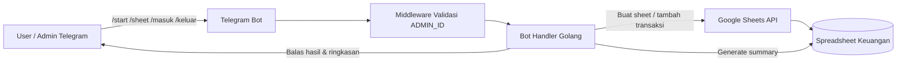
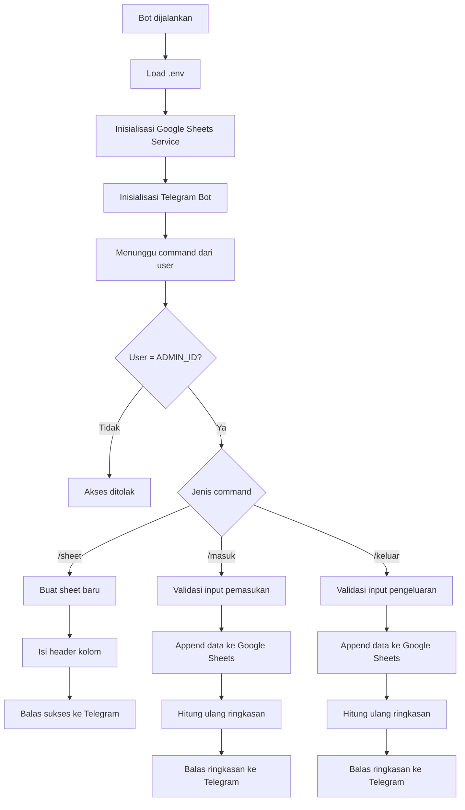

# bot_keuangan

Bot Telegram pribadi untuk mencatat pemasukan dan pengeluaran ke Google Sheets, lalu menampilkan ringkasan keuangan secara langsung.

## Fitur

- Membuat sheet baru dengan command `/sheet`
- Mencatat pemasukan dengan command `/masuk`
- Mencatat pengeluaran dengan command `/keluar`
- Membatasi akses hanya untuk `ADMIN_ID`
- Menampilkan ringkasan total masuk, keluar, sisa, dan breakdown kategori

## Skema Arsitektur



## Skema Alur Aplikasi



## Struktur Data Google Sheets

Setiap sheet yang dibuat akan memiliki header berikut:

| Tanggal | Kategori | Keterangan | Masuk | Keluar |
|---|---|---|---:|---:|
| 13-04-2026 09:30 | Pemasukan | Gaji | 5000000 | 0 |
| 13-04-2026 12:15 | Makan | Makan siang | 0 | 25000 |

## Command Bot

- `/start` menampilkan bantuan penggunaan bot
- `/sheet [nama_sheet]` membuat sheet baru
- `/masuk [nama_sheet] [nominal] [keterangan]` mencatat pemasukan
- `/keluar [nama_sheet] [nominal] [kategori] [keterangan]` mencatat pengeluaran

Contoh:

```bash
/sheet Tabungan
/masuk Tabungan 50000 Gaji
/keluar Tabungan 15000 Makan Nasi padang
```

## Environment Variable

Gunakan file `env-example` sebagai referensi:

```env
SPREADSHEET_ID=xxxxxxxx
TOKEN=xxxxxx
ADMIN_ID=xxxxx
```

## Teknologi

- Golang
- `gopkg.in/telebot.v3`
- Google Sheets API
- `github.com/joho/godotenv`
